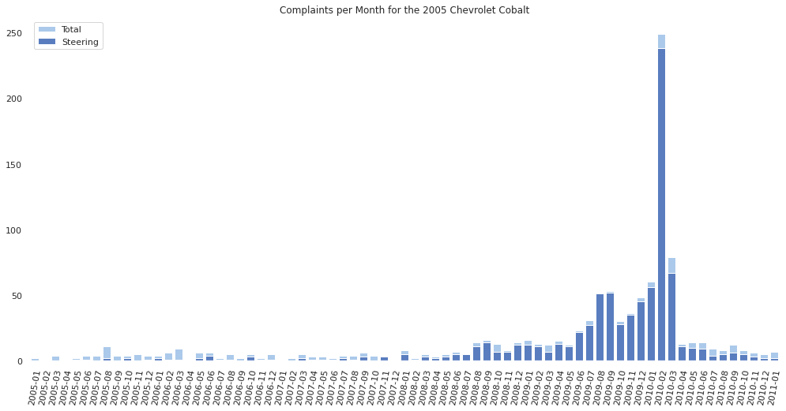

# NHTSA Complaints Analytics

This is a personal project based on the 2016-2020 strategic objectives stated by the NHTSA. 

### Motivation

In 2016, the NHTSA released their strategic objectives for 2016-2020, in a document called "The Road Ahead", in which they outlined a data-driven approach to several strategic goals. In particular, their second strategic goal was proactive vehicle safety, which listed an enhancement of the Office of Defects Investigations (ODI) as an objective. The need for this enhancement was justified by the scrutiny the NHTSA came under following the GM ignition switch recalls in 2014. This suggested a need for more effective ways of identifying potential defects, which is the main goal of this project. 

### About the data

The data for this project is pulled directly from the NHTSA's API. The data dictionaries are located in the materials_from_NHTSA/ folder. Directions for importing data may be found here:
<https://www.nhtsa.gov/nhtsa-datasets-and-apis>

### Examples

A showcase of the current tools that have been developed is given in the ipython notebook NHTSA_complaints_analysis.ipynb. Some examples are given below. 


```
cobalts_05_10 = VehicleList([Vehicle(i, 'chevrolet', 'cobalt') for i in range(2005,2010)])
cobalts_05_10.create_heatmap('ALL', 'complaints')
```


```cobalts_05_10.vehicle_list[0].comp_per_month(2011, 'STEERING', 'received')```



### In progress:
 1. Many vehicles of different brands come from the same production lines and/or use similar parts. This suggests studying vehicles in "production groups" instead of single vehicles. A data set needs to be built which contains a list of cars that come from the same production line, or have the same base parts.
 2. Feature engineering for complaint time-series.
 3. NLP on complaint descriptions.
