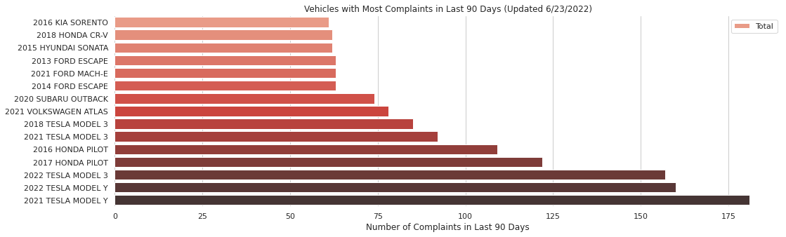
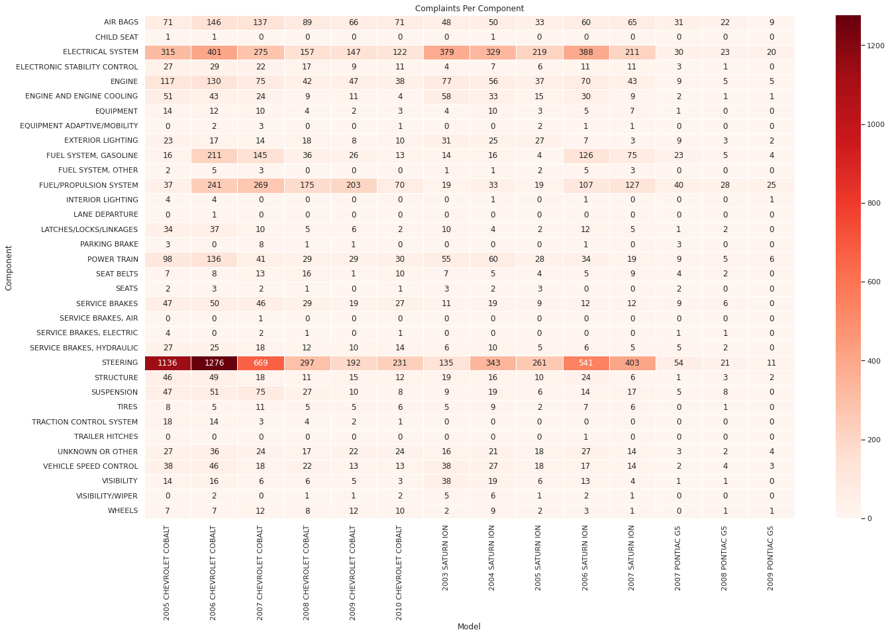

# NHTSA Complaints Analytics

This is a personal project based on the 2016-2020 strategic objectives stated by the NHTSA. 

### Motivation

In 2016, the NHTSA released their strategic objectives for 2016-2020, in a document called "The Road Ahead", in which they outlined a data-driven approach to several strategic goals. In particular, their second strategic goal was proactive vehicle safety, which listed an enhancement of the Office of Defects Investigations (ODI) as an objective. The need for this enhancement was justified by the scrutiny the NHTSA came under following the GM ignition switch recalls in 2014. This suggested a need for more effective ways of identifying potential defects. The goal of this project is to produce a toolkit which makes potential defects easier to spot.

### About the data

The data for this project is pulled directly from the NHTSA's API. The data dictionaries are located in the materials_from_NHTSA/ folder. Directions for importing data may be found here:
<https://www.nhtsa.gov/nhtsa-datasets-and-apis>

### Current Trends

Here are the vehicles with the most number of complaints over the last 90 days (as of 6/23/2022):



### Examples

A showcase of the current tools that have been developed is given in the ipython notebook NHTSA_complaints_analysis.ipynb. Some examples are given below. 


```
cobalts_05_10 = VehicleList([Vehicle(i, 'chevrolet', 'cobalt') for i in range(2005,2010)])
cobalts_05_10.create_heatmap('ALL', 'complaints')
```


```cobalts_05_10.vehicle_list[0].comp_per_month(2011, 'STEERING', 'received')```


### In progress:

- [x] Many vehicles of different brands come from the same production lines and/or use similar parts. This suggests studying vehicles in "production groups" instead of single vehicles. A data set needs to be built which contains a list of cars that come from the same production line, or have the same base parts.
    - This is complete, thanks to the gentlemen at Scalia Safety Engineering (SSE). This is a firm consisting of two crash reconstruction engineers who have kept a meticulous database of vehicles built from similar parts along with lots of other info which is important in crash reconstruction. 
    - They have requested that I not post the full database. So, I used python to generate a JSON file of vehicles which are in what I am defining as the same "production group". The rest of the info from the database provided by SSE is not available in this JSON file. This way, it cannot be reconstructed. 
    - Below is an example of the utility of this information. The trends in the heatmap above extend to the production group of the Chevy Cobalts.


- [ ] Convert tools into a dashboard (via [```dash``` and ```plotly```](https://github.com/plotly/dash))
- [ ] NLP on complaint descriptions.
