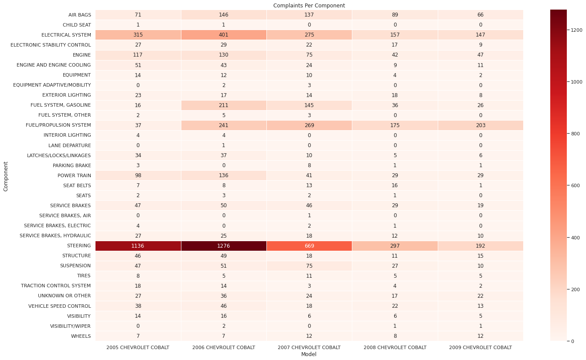

# NHTSA Complaints Heatmap

The NHTSAComplaints.py provides a collection of analytical tools for studying complaints submitted to the NHTSA (National Highway Traffic Safety Administration). This includes:
* Heatmaps displaying number of complaints, fires, crashes, etc. on a component level basis.
* Visualizations for complaints per month, also on a component level basis.
* Methods for easily producing complaint/recall dataframes.
The data is pulled directly from the NHTSA complaint API. 

